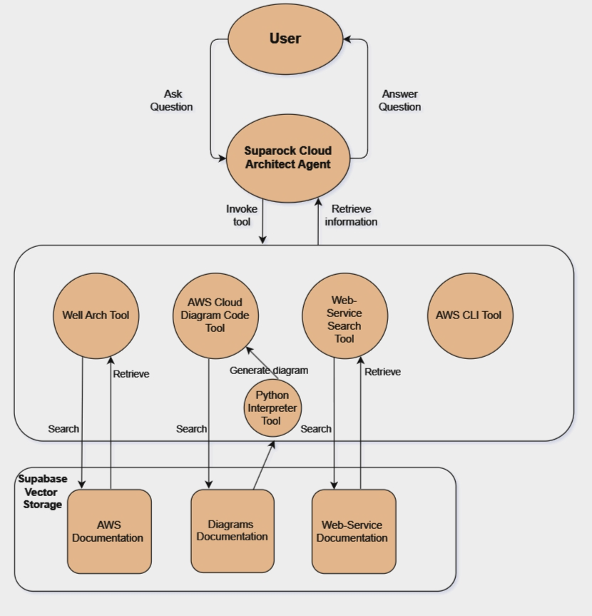

Suparock Cloud Architect Agent
---

_Submission for AWSupabase GenAI Hackathon_

Suparock Cloud Architect Agent assists users with AWS architecture management. It integrates directly with AWS services using the CLI, suggests best practices based on the AWS Well-Architected Framework and recommends relevant AWS web services. The agent can autonomously execute AWS CLI commands and generate dynamic cloud architecture diagrams, proving to be an intuitive companion for software engineers aiming to understand their cloud environment.

<iframe width="560" height="315" src="https://www.youtube.com/embed/F4z19IFjAP8" frameborder="0" allow="accelerometer; autoplay; clipboard-write; encrypted-media; gyroscope; picture-in-picture" allowfullscreen></iframe>

**Tech Stack**
- **Text Embedding Model**: Amazon Titan Text Embedding v2
- **Agent Model**: Anthropic Claude 3 Sonnet
- **Amazon Bedrock**: Serving foundation models
- **Database**: Supabase for vector storage
- **LangChain**: Manages agent orchestration and the Retrieval-Augmented Generation (RAG) pipeline




**Prerequisites**

Before you begin, ensure you have the following installed:

- Python 3.10 or higher
- Poetry for dependency management
- Accesss to AWS services
- Access to a Supabase project

### Installation

**1. Clone the repository**

```
git clone https://github.com/zacchaeuschok/suparock-cloud-architect
cd suparock-cloud-architect
```

**2. Install dependencies**

```
poetry install
```

**3. Set up database:**
```
supabase start
poetry run seed_text
```

**3. Set up environment variables:**

Create a .env file in the root directory and populate it with your AWS and Supabase credentials:
```
AWS_ACCESS_KEY_ID=your_access_key
AWS_SECRET_ACCESS_KEY=your_secret_key
AWS_SECRET_ACCESS_KEY=your_secret_key
AWS_SESSION_TOKEN=your_session_token
SUPABASE_URL=your_supabase_url
SUPABASE_KEY=your_supabase_key
```

You can retrieve your AWS credentials from the AWS Management Console.
Similarly, you can retrieve your Supabase credentials by running `supabase status`


**4. Test the application:**
```
streamlit run src/app.py
```

**By Sampson Ye, Zacchaeus Chok and OpenAI**
